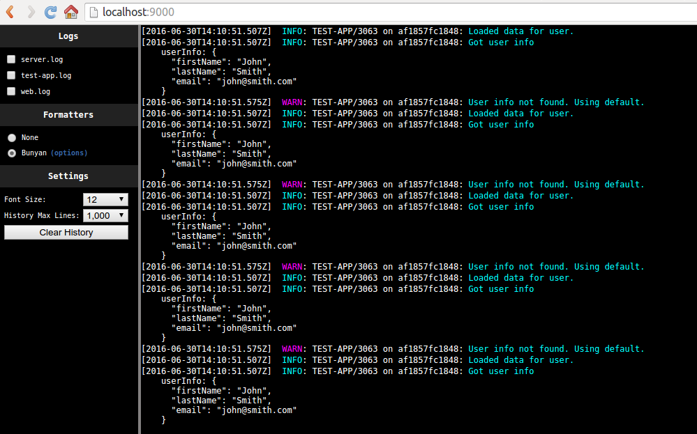

[](https://www.npmjs.com/package/natelogg)

Natelogg is a lightweight app for realtime tailing of logs to your browser. It's very quick and easy to set up.



### Installation

- Install globally using npm: `npm install -g natelogg`

### Configuration

Copy the following example config file to `~/.natelogg/config` and change values as necessary:

```javascript
var config = {};

//DEFINE THE SERVER PORT
config.port = 9000;

//DEFINE THE DIRECTORY WHERE LOGS ARE LOCATED
config.logDirectory = '/log';

/*******************************************
******** ADVANCED CONFIGURATION ***********
*******************************************/

//DEFINE PORT MAPPINGS FOR EACH APP YOU WISH TO INSPECT
config.portAppMap = {
    9229: 'main-api.log'
    9230: 'midware-api.log'
}

//DEFINE LOGS STREAMS THAT ARE UI APPS, THESE WILL AUTOMATICALLY REFRESH WHEN YOUR BUILD PROCESS COMPLETES
config.uiLogStreams = ['admin-ui.log', 'web-ui.log'];

//DEFINE PARTIAL STRING THAT INDICATES UI BUILD STARTING
config.uiBuildStartString = 'Now building webpack bundle for environment: dev';

//DEFINE PARTIAL STRING THAT INDICATES UI BUILD COMPLETE
config.uiBuildStopString = 'Finished build after';

module.exports = config;
```

### Usage

All files located in `config.logDirectory` are loaded in the Logs section. Check the checkbox next to the log(s) you wish to tail. Bunyan formatting can be enabled and configured in the Formatters section.

#### Run log server
```
natelogg-server
```

or

```
npm start
```

#### Run log server with bindings for Node --inspect (must set config.portAppMap)
```
npm run inspect
```

#### Run loger server with Live Reload for UI apps (must set config.uiLogStreams, config.uiBuildStartString, config.uiBuildStopString)
```
npm run liveReload
```

#### Run loger server with binding for Node --inspect and Live Reload for UI apps (must set all advanced configuration options)
```
npm run all
```